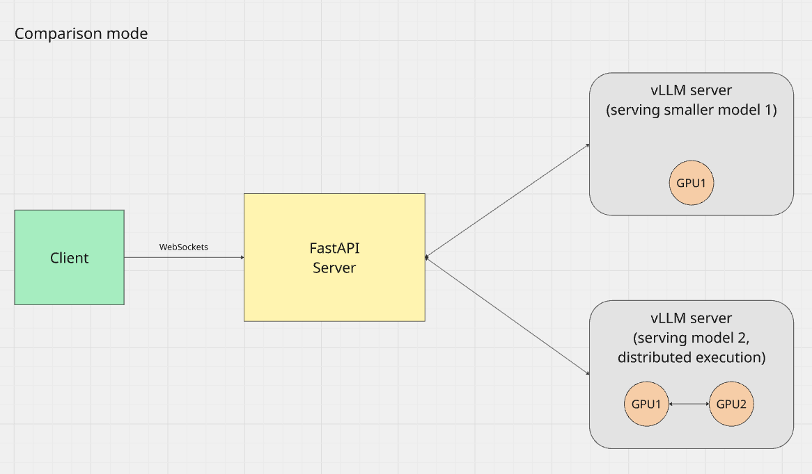

# This is a multimodel chat that simultaneously runs inference on two models and compares their outputs.

The chat has **2 modes**:

1. Single model mode (sm): Only one model is used for inference.
2. Comparison mode (cm): Two models are used for inference and their outputs are compared.

---

## Comparison mode

Runs two models on separate dedicated servers

Architecture:


---

## Single mode

Runs one model as a part of a main process

## Running the application

Running the following script will start main application and vllm servers

```
./run.sh
```
